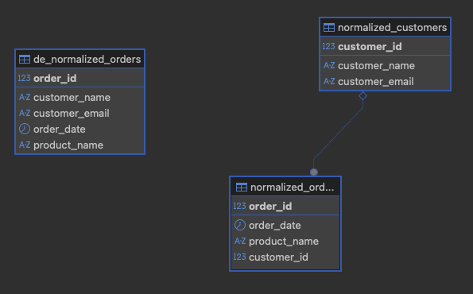

# **Module 3: Normalization**

- **Theory**: Normalization is a process for organizing data to reduce redundancy and improve data integrity. It's about breaking down large, complex tables into smaller, more manageable ones. This helps prevent issues where you have to update the same information in multiple places.
    
        - **First Normal Form (1NF)**: Each column must contain a single, atomic value, and there should be no repeating groups.
    
        - **Second Normal Form (2NF)**: Must be in 1NF, and all non-key columns must be fully dependent on the primary key. If you have a composite key, a column cannot depend on only part of it.
    
        - **Third Normal Form (3NF)**: Must be in 2NF, and there should be no transitive dependencies—meaning a non-key column should not depend on another non-key column.
    
- **PostgreSQL Example**:
    
        - Start with a de-normalized table containing redundant data (e.g., an orders table with repeated customer information).
    
        - Walk through the process of breaking it down into separate, normalized orders and customers tables.
    


```SQL
-- This script shows how to normalize a de-normalized table
-- to reduce data redundancy and improve data integrity.
-- 0. Checking current db context
SELECT current_database(), current_schema(), CURRENT_USER;
SELECT CURRENT_SCHEMA, CURRENT_USER;

-- Show current tables in the current schema using the information schema
SELECT table_name
FROM information_schema.tables
WHERE table_schema = current_schema();

-- Drop existing tables
DROP TABLE IF EXISTS normalized_orders;
DROP TABLE IF EXISTS normalized_customers;
DROP TABLE IF EXISTS de_normalized_orders;

-- 1. Create a de-normalized table with repeated customer information
CREATE TABLE de_normalized_orders (
order_id SERIAL PRIMARY KEY,
customer_name VARCHAR(100),
customer_email VARCHAR(100),
order_date DATE,
product_name VARCHAR(100)
);

-- 2. Insert sample data. Notice the redundancy in customer information.
INSERT INTO de_normalized_orders (customer_name, customer_email, order_date, product_name) VALUES
('Jane Doe', 'jane.doe@example.com', '2023-10-01', 'Laptop'),
('John Smith', 'john.smith@example.com', '2023-10-02', 'Mouse'),
('Jane Doe', 'jane.doe@example.com', '2023-10-03', 'Keyboard');

SELECT * from de_normalized_orders;

-- 3. Now, let's normalize this data into two tables: customers and orders.
-- - This eliminates repeated customer data.
CREATE TABLE normalized_customers (
customer_id SERIAL PRIMARY KEY,
customer_name VARCHAR(100),
customer_email VARCHAR(100) UNIQUE
);

CREATE TABLE normalized_orders (
order_id SERIAL PRIMARY KEY,
order_date DATE,
product_name VARCHAR(100),
customer_id INTEGER,
FOREIGN KEY (customer_id) REFERENCES normalized_customers(customer_id)
);

-- 4. Insert data into the normalized tables.
-- - First, insert customers (only once).
INSERT INTO normalized_customers (customer_name, customer_email) VALUES
('Jane Doe', 'jane.doe@example.com'),
('John Smith', 'john.smith@example.com');

SELECT * from normalized_customers;

-- - Then, insert orders using the customer_id as the link.
-- (Assuming customer_id 1 is Jane Doe and 2 is John Smith)
INSERT INTO normalized_orders (customer_id, order_date, product_name) VALUES
(1, '2023-10-01', 'Laptop'),
(2, '2023-10-02', 'Mouse'),
(1, '2023-10-03', 'Keyboard');

SELECT * from normalized_orders;

-- 5. Query the normalized tables using a JOIN to get the full order details.
SELECT
o.order_id,
c.customer_name,
c.customer_email,
o.order_date,
o.product_name
FROM normalized_orders o
JOIN normalized_customers c ON o.customer_id = c.customer_id;
```


## **Additional Example 1: Moving to First Normal Form (1NF) 📚**

This example demonstrates how to fix a violation of First Normal Form (1NF) by splitting a non-atomic column into separate rows. The de-normalized `students` table has a `courses` column with a list of values. To normalize it, we create a new `student_courses` junction table where each row contains a single, atomic value.


Think of a table in 1NF as a tidy grid where every single cell holds only one value. No messy lists or groups of repeating information in a single cell. Every cell should contain a single, indivisible value (an "atomic" value), and each row needs a unique identifier, or primary key.

In the table on the left, Alex Johnson's row is a mess because the courses column contains multiple values, which is a big violation of 1NF. To fix this, you split the information so each course gets its own row. The table on the right is now in 1NF because each cell has just one value.

By doing this, you're not just making the data tidy, you're making it usable. Now you can easily search for students who are taking a specific course, like Literature, without having to search through a comma-separated list.

```SQL
-- Example 1: Fixing a 1NF Violation by creating a junction table
-- 0. Checking current db context
SELECT current_database(), current_schema(), CURRENT_USER;
SELECT CURRENT_SCHEMA, CURRENT_USER;

-- Show current tables in the current schema using the information schema
SELECT table_name
FROM information_schema.tables
WHERE table_schema = current_schema();

-- Drop existing tables to start fresh
DROP TABLE IF EXISTS student_courses;
DROP TABLE IF EXISTS students_1nf_violation;
DROP TABLE IF EXISTS students_normalized;
DROP TABLE IF EXISTS courses;

-- 1. Create a table that violates 1NF with a non-atomic 'courses' column.
-- This is bad practice and makes querying difficult.
CREATE TABLE students_1nf_violation (
    student_id SERIAL PRIMARY KEY,
    student_name VARCHAR(100),
    courses TEXT -- Non-atomic value (e.g., 'Math, Physics, Chemistry')
);

-- 2. Insert sample data with repeating groups.
INSERT INTO students_1nf_violation (student_name, courses) VALUES
('Alex Johnson', 'History, Literature'),
('Beth Williams', 'Math, Physics, Chemistry'),
('Charlie Davis', 'Biology');

SELECT * from students_1nf_violation;

-- 3. Now, let's normalize this data to 1NF.
-- We'll create a normalized 'students' table and a separate 'courses' table.
-- Then we'll use a junction table to link them.
CREATE TABLE students_normalized (
    student_id SERIAL PRIMARY KEY,
    student_name VARCHAR(100)
);

CREATE TABLE courses (
    course_id SERIAL PRIMARY KEY,
    course_name VARCHAR(100) UNIQUE
);

-- 4. Create the junction table to handle the many-to-many relationship
-- A student can take many courses, and a course can have many students.
CREATE TABLE student_courses (
    student_id INTEGER REFERENCES students_normalized(student_id),
    course_id INTEGER REFERENCES courses(course_id),
    PRIMARY KEY (student_id, course_id)
);

-- 5. Insert data into the normalized tables.
INSERT INTO students_normalized (student_name) VALUES
('Alex Johnson'),
('Beth Williams'),
('Charlie Davis');

SELECT * from students_normalized;

INSERT INTO courses (course_name) VALUES
('History'),
('Literature'),
('Math'),
('Physics'),
('Chemistry'),
('Biology');

SELECT * from courses;

-- 6. Now, insert into the junction table to link students to their courses.
INSERT INTO student_courses (student_id, course_id) VALUES
(1, 1), -- Alex takes History
(1, 2), -- Alex takes Literature
(2, 3), -- Beth takes Math
(2, 4), -- Beth takes Physics
(2, 5), -- Beth takes Chemistry
(3, 6); -- Charlie takes Biology

SELECT * from student_courses;

-- 7. Query the normalized tables to get the full data.
SELECT
    s.student_name,
    c.course_name
FROM students_normalized s
JOIN student_courses sc ON s.student_id = sc.student_id
JOIN courses c ON sc.course_id = c.course_id;
```

---

##  **Additional Example 2: Reaching Second Normal Form (2NF) 📦**

This example demonstrates how to resolve a Second Normal Form (2NF) violation. We start with a de-normalized `order_details` table that has a composite key of `order_id` and `product_id`. The non-key column `product_name` only depends on `product_id` (part of the composite key), which violates 2NF. The solution is to move the product-specific information to a new `products` table.

To be in 2NF, a table must already be in 1NF. The main rule of 2NF is that all the columns that aren't part of the primary key must depend on the entire primary key. This rule is most important when you have a composite primary key, which is a primary key made up of two or more columns.

Let's use the example from the article.
The de_normalized_order_details table has a composite key made up of order_id and product_id. The product_name column, however, only depends on the product_id, not the whole key. It doesn't need to know the order_id to know what the product is. This is a partial dependency, which is a violation of 2NF.

To fix this, you create a new table, products_2nf_normalized, that contains only product_id and product_name. Now, product_name has its own home where it only depends on its own primary key, product_id. The original table, now named orders_2nf_normalized, only needs the product_id to link back to the product information. This eliminates redundancy and makes the database more efficient.


```SQL
-- Example 2: Achieving 2NF by removing partial dependencies
-- 0. Checking current db context
SELECT current_database(), current_schema(), CURRENT_USER;
SELECT CURRENT_SCHEMA, CURRENT_USER;

-- Show current tables in the current schema using the information schema
SELECT table_name
FROM information_schema.tables
WHERE table_schema = current_schema();

-- Drop existing tables
DROP TABLE IF EXISTS orders_2nf_normalized;
DROP TABLE IF EXISTS products_2nf_normalized;
DROP TABLE IF EXISTS de_normalized_order_details;

-- 1. Create a de-normalized table that violates 2NF.
-- The composite primary key is (order_id, product_id).
-- product_name only depends on product_id, not the full key.
CREATE TABLE de_normalized_order_details (
    order_id INTEGER,
    product_id INTEGER,
    product_name VARCHAR(100),
    quantity INTEGER,
    PRIMARY KEY (order_id, product_id)
);

-- 2. Insert sample data.
INSERT INTO de_normalized_order_details (order_id, product_id, product_name, quantity) VALUES
(101, 1, 'Laptop', 1),
(101, 2, 'Mouse', 1),
(102, 1, 'Laptop', 2); -- Redundancy: 'Laptop' is repeated with different orders.

SELECT * from de_normalized_order_details;

-- 3. Normalize to 2NF by splitting the table.
-- We'll create a separate 'products' table for product-specific data.
CREATE TABLE products_2nf_normalized (
    product_id SERIAL PRIMARY KEY,
    product_name VARCHAR(100) UNIQUE
);

CREATE TABLE orders_2nf_normalized (
    order_id INTEGER,
    product_id INTEGER,
    quantity INTEGER,
    PRIMARY KEY (order_id, product_id),
    FOREIGN KEY (product_id) REFERENCES products_2nf_normalized(product_id)
);

-- 4. Insert data into the normalized tables.
INSERT INTO products_2nf_normalized (product_id, product_name) VALUES
(1, 'Laptop'),
(2, 'Mouse');

SELECT * from products_2nf_normalized;

INSERT INTO orders_2nf_normalized (order_id, product_id, quantity) VALUES
(101, 1, 1),
(101, 2, 1),
(102, 1, 2);

SELECT * from orders_2nf_normalized;

-- 5. Query the normalized tables using a JOIN.
SELECT
    o.order_id,
    p.product_name,
    o.quantity
FROM orders_2nf_normalized o
JOIN products_2nf_normalized p ON o.product_id = p.product_id;
```

---

## **Additional Example 3: Reaching Third Normal Form (3NF) 📝**

This example demonstrates how to resolve a Third Normal Form (3NF) violation, a **transitive dependency**. We start with a `books` table where `author_country` is dependent on `author_name`, and `author_name` is dependent on the primary key `book_id`. This means `author_country` is transitively dependent on `book_id`through `author_name`. The solution is to extract `author` information into its own table, linking it back to the `books` table with a foreign key.

To be in 3NF, a table must already be in 2NF. The rule here is simple: all non-key columns must be dependent on the primary key, and nothing but the primary key. This means you must eliminate transitive dependencies. A transitive dependency happens when a non-key column depends on another non-key column.

Consider the books_3nf_violation table. The primary key is book_id. book_title depends on the book_id, and author_name also depends on book_id. So far, so good. However, the author_country column depends on author_name, not directly on book_id. This creates a transitive dependency—author_country is dependent on book_id through author_name. This is a 3NF violation and causes redundancy, as you see with the repeated "United Kingdom" entry.

To resolve this, you split the table. You create a new authors table with author_id as the primary key and move author_name and author_country there. You then update the original books table to only include the author_id as a foreign key. This removes the transitive dependency and the data redundancy. Now, if J.R.R. Tolkien's country of origin needs to be updated, you only have to change it in one place: the authors table.


```SQL
-- Example 3: Achieving 3NF by removing transitive dependencies
-- 0. Checking current db context
SELECT current_database(), current_schema(), CURRENT_USER;
SELECT CURRENT_SCHEMA, CURRENT_USER;

-- Show current tables in the current schema using the information schema
SELECT table_name
FROM information_schema.tables
WHERE table_schema = current_schema();

-- Drop existing tables
DROP TABLE IF EXISTS authors_3nf_normalized;
DROP TABLE IF EXISTS books_3nf_normalized;
DROP TABLE IF EXISTS books_3nf_violation;

-- 1. Create a table that violates 3NF.
-- 'author_country' is transitively dependent on 'book_id'
-- through 'author_name'.
CREATE TABLE books_3nf_violation (
    book_id SERIAL PRIMARY KEY,
    book_title VARCHAR(255),
    author_name VARCHAR(100),
    author_country VARCHAR(100)
);

-- 2. Insert sample data. Note the redundancy in author information.
INSERT INTO books_3nf_violation (book_title, author_name, author_country) VALUES
('The Lord of the Rings', 'J.R.R. Tolkien', 'United Kingdom'),
('The Hobbit', 'J.R.R. Tolkien', 'United Kingdom'), -- Redundancy here
('Dune', 'Frank Herbert', 'United States');

SELECT * from books_3nf_violation;

-- 3. Normalize to 3NF by splitting the table.
-- We'll create a separate 'authors' table to remove the transitive dependency.
CREATE TABLE authors_3nf_normalized (
    author_id SERIAL PRIMARY KEY,
    author_name VARCHAR(100) UNIQUE,
    author_country VARCHAR(100)
);

CREATE TABLE books_3nf_normalized (
    book_id SERIAL PRIMARY KEY,
    book_title VARCHAR(255),
    author_id INTEGER REFERENCES authors_3nf_normalized(author_id)
);

-- 4. Insert data into the normalized tables.
INSERT INTO authors_3nf_normalized (author_name, author_country) VALUES
('J.R.R. Tolkien', 'United Kingdom'),
('Frank Herbert', 'United States');

SELECT * from authors_3nf_normalized;
-- 5. Insert into the books table using the foreign key.
INSERT INTO books_3nf_normalized (book_title, author_id) VALUES
('The Lord of the Rings', 1),
('The Hobbit', 1),
('Dune', 2);

SELECT * from books_3nf_normalized;

-- 6. Query the normalized tables using a JOIN.
SELECT
    b.book_title,
    a.author_name,
    a.author_country
FROM books_3nf_normalized b
JOIN authors_3nf_normalized a ON b.author_id = a.author_id;
```
